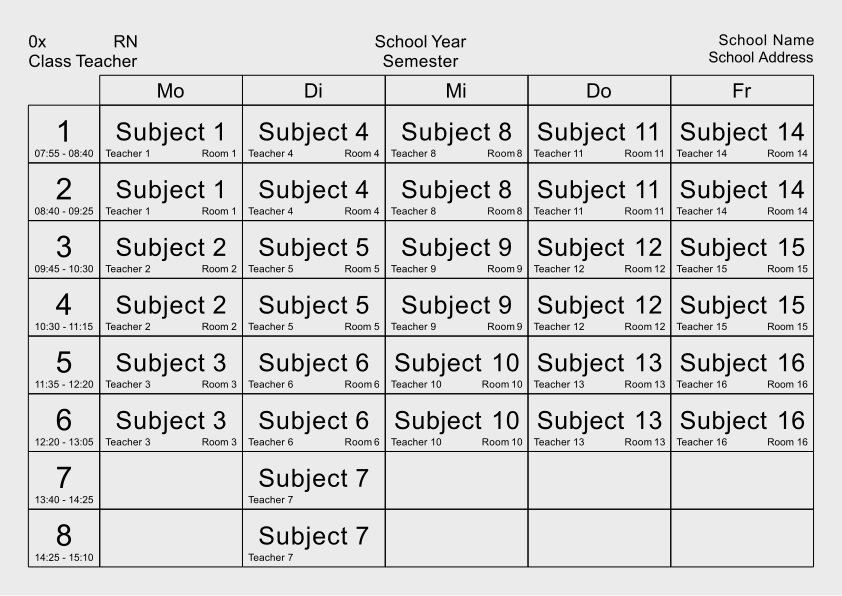

<h1 align="center">timetable-gen</h1>
<p align="center">
  <b>
    📅 A command-line tool to generate a neatly organized, configurable 
    timetable PDF.
  </b>
</p>

<br>

<p align="center">
  <a href="https://github.com/cptpiepmatz/timetable-gen">
    <!-- make this dynamic when dynamic toml badges drop -->
    
  </a>
  <a href="https://github.com/cptpiepmatz/nu-plugin-highlight/blob/main/LICENSE">
      
  </a>
</p>

## About
`timetable-gen` is a command-line tool designed to simplify the creation of 
timetables. 
It takes a configuration file in TOML format as input, processes the given data, 
and outputs a neatly organized timetable in PDF format. 
The output PDF will be in A4 landscape orientation, with the classes matrix 
fitted as needed according to your configuration file.



## Installation
### Pre-built Binary
Pre-built binaries for `timetable-gen` can be found on the 
[Releases](https://github.com/cptpiepmatz/timetable-gen/releases) page of the 
repository. 
Download the appropriate binary for your operating system. 
You can run the binary directly without any dependencies.

### Building from Source
To build `timetable-gen` from source, you need to have Rust installed on your 
machine. 
If you don't have Rust installed, you can install it via 
[rustup](https://rustup.rs).

Once you have Rust installed, you can build `timetable-gen` by cloning the 
repository and running `cargo build --release`:

```shell
git clone https://github.com/cptpiepmatz/timetable-gen.git
cd timetable-gen
cargo build --release
```

The built binary can be found in the `target/release` directory and can be run 
directly without any dependencies.

## Usage
The `timetable-gen` tool is controlled via command-line arguments. 
The basic usage is as follows:

```shell
timetable-gen [OPTIONS]
```

### Arguments
- `-c, --config <File>`:
  The path to the TOML configuration file required to generate the timetable. 
  Defaults to `timetable.toml`.

- `-o, --out <File>`:
  The path where the output PDF should be generated. 
  Defaults to `timetable.pdf`.

For example:
```shell
timetable-gen --config path/to/config.toml --out path/to/timetable.pdf
```

## Configuration
The configuration of `timetable-gen` is done through a TOML file. 
Here's the structure of the configuration file:

```toml
class_name = "0x"
class_room = "RN"
class_teacher = "Class Teacher"

title = "School Year"
subtitle = "Semester"

school_name = "School Name"
school_address = "School Address"

class_durations = [
    "07:55 - 08:40",
    ...
    "16:05 - 16:50"
]

[day_identifiers]
monday = "Mo"
...

[[monday]]
class = "Subject 1"
teacher = "Teacher 1"
room = "Room 1"

[[monday]]
class = "Subject 2"
teacher = true
room = true
...
```

- `class_name`: The name of the class.
- `class_room`: The room code for the classroom.
- `class_teacher`: The name for the class teacher.
- `title`: The title of the timetable.
- `subtitle`: The subtitle of the timetable.
- `school_name`: The name of the school.
- `school_address`: The address of the school.
- `class_durations`: The duration of each class throughout the day.
- `day_identifiers`: The abbreviations for each day of the week.
- `monday`, `tuesday`, ..., `sunday`: 
  The subjects, teachers, and rooms for each day of the week. 
  Each day is represented as a list of `ClassEntry` objects, all fields are 
  optional.
  For `teacher` and `room` the values may also be `true`, to use the class 
  teacher/room.
  - `class`: The subject being taught.
  - `teacher`: The teacher teaching the subject.
  - `room`: The room in which the class is being held.

### Example Configuration
A complete example of a configuration file can be found in the repository:
[`example/timetable.toml`](example/timetable.toml).

It is recommended to name your own configuration file also `timetable.toml`, 
as this is the default file aht the CLI will look for.


## License
`timetable-gen` is licensed under the [MIT License](LICENSE).

The LiberationSans font, used in this project, is licensed under its own 
license. 
The font files and accompanying license can be found in the `fonts` directory.
